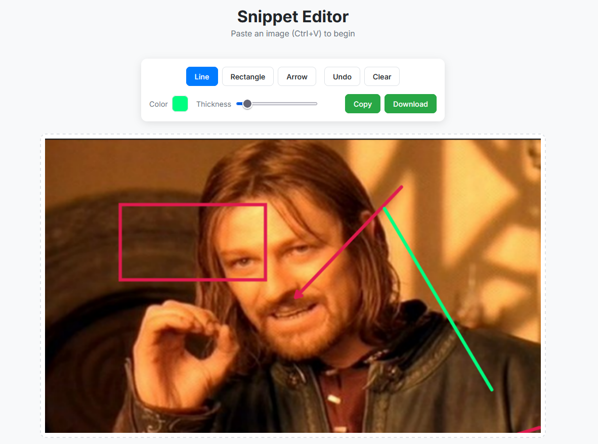

# Snippet Editor

A simple, browser-based image editor built with HTML, CSS, and vanilla JavaScript. This tool allows you to paste an image from your clipboard, make quick annotations, and then copy to clipboard or download your work.

## Features

- **Paste from Clipboard:** Instantly paste images using Ctrl+V.
- **Drawing Tools:** Annotate with Lines, Rectangles, and Arrows.
- **Customization:** Change color and line thickness on the fly.
- **Undo:** Multi-level undo functionality to correct mistakes.
- **Export Options:** Download your edited image as a PNG or copy it back to your clipboard.
- **Responsive Design:** The layout adapts for use on both desktop and mobile devices.

## How to Use

1.  Take a screenshot or copy an image to your clipboard.
2.  Press `Ctrl+V` (or `Cmd+V`) to paste the image into the editor.
3.  Select a tool and draw on the image.
4.  Use the "Copy" or "Download" buttons to export your creation.

## Live Demo

[Try it out!](https://www.trevorbrowning.com/snippet-editor)
